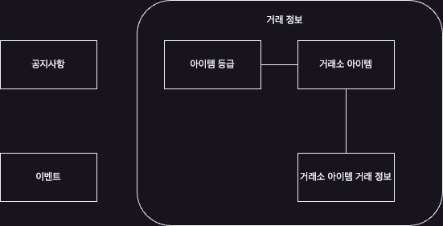
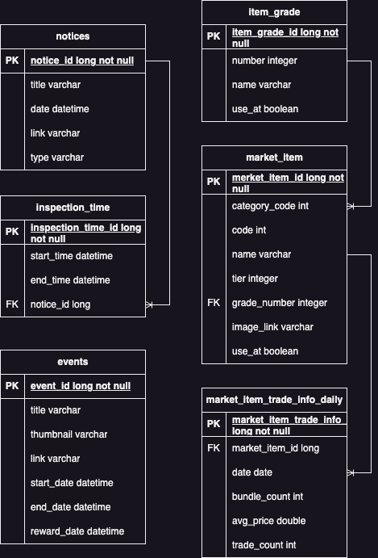

# 'LOSTARK'에서 거래소 아이템 가격 변동을 확인하는 사이트 개발

수정일: 2023-09-24

## 0.무엇이 문제인가?
&emsp;골드가 부족하다.

&emsp;로스트아크를 플레이하면서 가장 중요한 인게임 재화 중 하나는 **골드**이다. 게임을 플레이하며 필요한 장비 아이템의 재련에 골드가 소모되며 또 기타 여러 필요 물품들을 화페 거래소, 거래소, 경매장, NPC 등을 통해 골드로 구매할 수 있다.

&emsp;골드는 상대적으로 많으면 많을수록 좋다. NPC가 고정 가격으로 파는 물품에 비해 골드가 많거나, 다른 플레이어가 가진 골드에 비해 많을 경우 게임 플레이가 쾌적해 질 수 있다.

&emsp;이 골드를 게임 서버에서 생산하는 방법은 아래와 같다. 아래 방법들을 통해 스마일게이트 알피지가 책정하는 고정된 양을 받거나, 랜덤 확률로 골드를 얻게 된다.
- 엔드 컨텐츠: 어비스 레이드, 어비스 던전, 군단장 레이드
- 카오스 던전: 운명의 편린
- 에포나 증표: 골드 상점
- 모험의 섬
- NPC 호감도
- 기타 퀘스트 및 이벤트

&emsp;이렇게 서버에서 골드를 직접 생산하는 방법들은 생산량이 고정적이거나, 운에 크게 의존하기에 위 방법들을 베이스로 골드를 추가로 수급할 수 있는 방법이 필요하다.

## 1. 어떻게 해결할 것인가?
&emsp;골드를 직접 생산하는 방법 외로는 유저간의 거래를 통해 골드를 얻을 수 있다. 주로, 거래소나 경매장을 통해 판매하고자 하는 아이템과 골드를 교환한다. 같은 서버 내의 캐릭터끼리는 우편으로도 거래가 가능하다.

&emsp;다른 유저의 골드와 교환할 수 있는 아이템 중에서 그나마 확률에 큰 영향을 받지 않고 얻을 수 있는 아이템은 파괴석류, 수호석류, 돌파석류, **생활**아이템류이다. 파괴/수호/돌파석 류는 캐릭터의 장비 아이템 레벨을 올리는 데 필요한 강화재료다. 생활아이템은 강화재료를 만드는데도 필요하고, 기타 여러 아이템 제작에 필요한 재료로 활용된다. 파괴/수호/돌파석류의 주요 서버 생산처는 일일 컨텐츠인 카오스 던전과 가디언 토벌이다. 생활아이템은  원정대별로 보유한 생명의 기운을 소모하여 생활 컨텐츠를 진행, 그 결과로 아이템을 얻을 수 있다. 

&emsp;생활 컨텐츠의 종류와 그로 인해 획득할 수 있는 아이템은 다음과 같다.
- 채집: 들꽃, 수줍은 들꽃, 화사한 들꽃, 투박한 버섯, 싱싱한 버섯, 화려한 버섯
- 벌목: 목재, 부드러운 목재, 튼튼한 목재
- 채광: 철광석, 묵직한 철광석, 단단한 철광석
- 수렵: 두툼한 생고기, 다듬은 생고기, 질긴 가죽, 오레하 두툼한 생고기, 수렵의 결정
- 낚시: 생선, 붉은 살 생선, 자연산 진주, 오레하 태양 잉어, 낚시의 결정
- 고고학: 고대 유물, 희귀한 유물, 오레하 유물, 고고학의 결정

&emsp;이 사이트에서는 스마일게이트 알피지에서 제공하는 lost-ark api를 통해 (우선적으로) 거래소에서 거래되는 생활 아이템의 가격과 거래량을 수집한다. 그리고 누적된 데이터를 웹 브라우저를 통해 표출하는 것을 목표로 한다.
- 앞서 기술한대로 일일 획득량이 고정적인 편이다.
- 가격의 변동이 있다. 그 시기는 주로 수요가 증가할 때로 보이며, 특히 새로운 엔드 컨텐츠의 출시 및 입장 제한 장비 아이템 레벨이 발표될 때로 보인다. (각종 베틀 아이템 수요 증가, 장비 아이템 레벨 성장에 직접 필요한 강화 재료 수요 증가)
- 이에 따라 일일 획득 + 가격이 저점일 때의 매입 후, 가격이 고점일 때 판매하여 차익을 남길 수 있을 것으로 예상된다.
- lost-ark api 에서 제공하는 생활 아이템의 가격과 거래량 정보는 최근 14일이 전부다. 따라서 이를 누적/기록 하는 프로그램을 작성하여 생활 아이템의 구매/판매에 도움이 되는 정보를 제공한다.

## 2. 프로그램 정보

&emsp;목표로 했던 웹 사이트의 구현, 약간의 새로운 학습을 목표로 프로그램을 개발한다.

### 사이트 주소
http://ec2-3-37-14-93.ap-northeast-2.compute.amazonaws.com/

### 활용 기술
- Amazon Linux 2023 - EC2 t2.micro
- Maria DB 10.6.14 - db.t3.micro
- Java 17
- Gradle 8.2.1
- Spring boot 3.1.2
- Spring Data Jpa
- Thymeleaf
- jQuery 3.7.1
- Bootstrap 5.3.1
- Chart.js 4.4.0

### 엔티티 다이어그램

### ERD

### API

**# GET ~/api/v1/events?startDate=yyyy-mm-dd&endDate=yyyy-mm-dd**

응답 형태
~~~
{
    "data": [
        {
            "id": long
            "title": string
            "thumbnail": string
            "link": string
            "startDate": string(yyyy-mm-dd'T'hh:mm:ss.SSS)
            "endDate": string(yyyy-mm-dd'T'hh:mm:ss.SSS)
            "rewardDate": string(yyyy-mm-dd'T'hh:mm:ss.SSS)
        }
    ]
}
~~~

 

**# GET ~/api/v1/events/{id}**

응답 형태
~~~
{
    "data": {
        "id": long,
        "title": string,
        "thumbnail": string,
        "link": string,
        "startDate": string(yyyy-mm-dd'T'hh:mm:ss.SSS),
        "endDate": string(yyyy-mm-dd'T'hh:mm:ss.SSS),
        "rewardDate": string(yyyy-mm-dd'T'hh:mm:ss.SSS)
    }
}
~~~

 

**# GET ~/api/v1/notices?startDate=yyyy-mm-dd&endDate=yyyy-mm-dd**

응답 형태
~~~
{
    "data": [
        {
            "id": long,
            "title": string,
            "date": string(yyyy-mm-dd'T'hh:mm:ss.SSS),
            "link": string,
            "type": string
        }
    ]
}
~~~

 

**# GET ~/api/v1/notices/{id}**

응답 형태
~~~
{
    "data": {
        "id": long,
        "title": string,
        "date": string(yyyy-mm-dd'T'hh:mm:ss.SSS),
        "link": string,
        "type": string
    }
}
~~~

 

**# GET ~/api/v1/market-items?categoryCode=#####**

응답 형태
~~~
{
    "data": [
        {
            "number": integer,
            "itemGradeName": string,
            "id": long,
            "categoryCode": integer,
            "code": integer,
            "name": string,
            "tier": integer,
            "imageLink": string,
            "useAt": boolean,
            "dataList": []
        }
    ]
}
~~~

 

**# GET ~/api/v1/market-items/{id}**

응답 형태
~~~
{
    "data": {
        "number": integer,
        "itemGradeName": string,
        "id": long,
        "categoryCode": integer,
        "code": integer,
        "name": string,
        "tier": integer,
        "imageLink": string,
        "useAt": boolean,
        "dataList": []
    }
}
~~~

 

**# GET ~/api/v1/market-items/{id}/data?startDate=yyyy-mm-dd&endDate=yyyy-mm-dd**

응답 형태
~~~
{
    "data": {
        "number": integer,
        "itemGradeName": string,
        "id": long,
        "categoryCode": integer,
        "code": integer,
        "name": string,
        "tier": integer,
        "imageLink": string,
        "useAt": boolean,
        "dataList": [
            {
                "number": integer,
                "itemGradeName": string,
                "categoryCode": integer,
                "code": integer,
                "marketItemName": string,
                "tier": 3,
                "imageLink": string,
                "id": long,
                "date": string(yyyy-mm-dd'T'hh:mm:ss),
                "avgPrice": double,
                "tradeCount": integer,
                "bundleCount": integer
            }
        ]
    }
}
~~~

 

**# GET ~/api/v1/market-item-trade-info-dailies?startDate=yyyy-mm-dd&endDate=yyyy-mm-dd**

응답 형태
~~~
{
    "data": [
        {
            "number": integer,
            "itemGradeName": string,
            "categoryCode": integer,
            "code": integer,
            "marketItemName": string,
            "tier": integer,
            "imageLink": string,
            "id": long,
            "date": string(yyyy-mm-dd'T'hh:mm:ss),
            "avgPrice": double,
            "tradeCount": integer,
            "bundleCount": integer
        }
    ]
}
~~~

 

**# GET ~/api/v1/market-item-trade-info-dailies/{id}**

응답 형태
~~~
{
    "data": {
        "number": integer,
        "itemGradeName": string,
        "categoryCode": integer,
        "code": integer,
        "marketItemName": string,
        "tier": integer,
        "imageLink": string,
        "id": long,
        "date": string(yyyy-mm-dd'T'hh:mm:ss),
        "avgPrice": double,
        "tradeCount": integer,
        "bundleCount": integer
    }
}
~~~

 

### 차후 업데이트 고려 사항
- Spring REST Docs 또는 Swagger 를 통해 문서 자동화
- 코드 정리
- 테스트 환경 변경(테스트 용 데이터(테스트 DB?), 테스트 단위 마다의 새로운 context(멱등성), 테스트 단위 마다의 entity 초기화(멱등성))
- 테스트 코드 추가
- Market Item Trade Info Daily 업데이트 방식 변경: JPQL 또는 Query DSL 로 일괄 UPDATE?
- Query DSL 적용
- 거래량, 가격과 공지, 이벤트 간의 상관관계-회귀분석
- Event 도메인 제거(생활재료의 생산과 소비에 영향을 거의 주지 않을 것으로 보임)
- front-end framework 활용(아마도 Vue.js)
- Kotlin 코드 추가 혹은 교체(프로젝트를 통째로 교체 할까?)
- 배포 자동화
- 도메인 구매
- Spring Security 적용